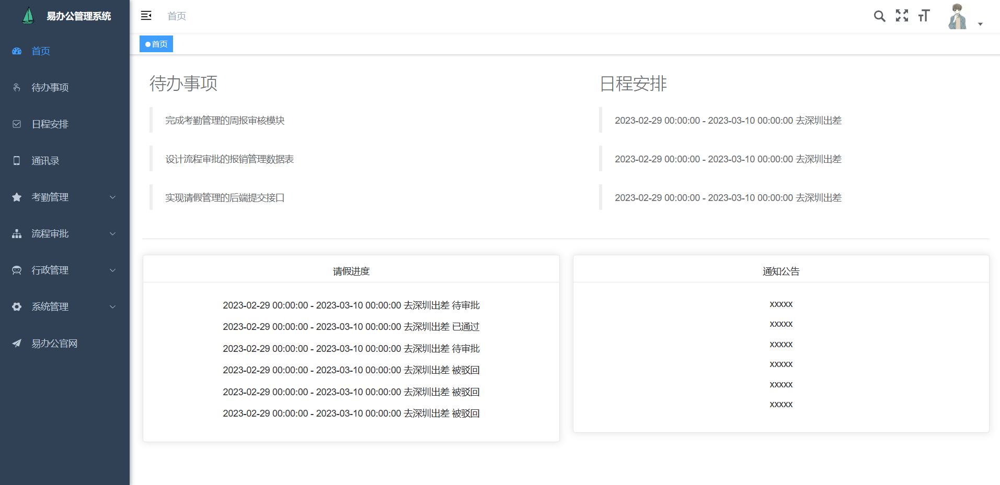
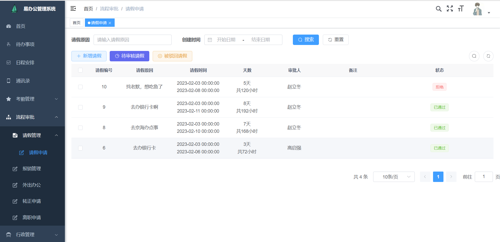

## 项目介绍
易办公管理系统（e_oa）,一个基于 SpringBoot 的前后端分离的办公信息化自动化系统，该项目主要是学习和使用 flowable 实现一些复杂的工作流程，在办公系统中很多场景都需要使用到工作流，比如请假审批、报销审批、转正申请等，使用 flowable 实现自动服务、控制一些复杂审核流程，在项目中都有体现。

### 项目技术栈

#### 后端技术栈
1. java11
2. spring boot
3. spring security+jwt
4. mysql
5. mybatis
6. redis
7. flowable

#### 前端技术栈
1. vue3
2. element-plus

### 项目模块

1. e_oa-admin —— web入口模块
2. e_oa-common —— 公共模块
3. e_oa-framework —— 框架核心模块
4. e_oa-todo -- 待办事项管理
5. e_oa-schedule —— 日程安排管理
6. e_oa-daily —— 日报管理
7. e_oa-leave —— 请假管理
8. e_oa-system —— 系统管理

待完成模块

1. 报销管理
2. 周报管理
3. 外出办公管理
4. 转正管理
5. 离职申请
6. 会议室管理
7. 车辆管理

### flowable工作流程图
（由于时间原因，其他模块还没写）

日报流程

请假流程

### 项目效果图
（展示部分页面）

登录页面

首页

日程安排

通讯录

请假申请

请假审批

请假驳回重填

### 项目接口文档
使用 apifox 测试接口
